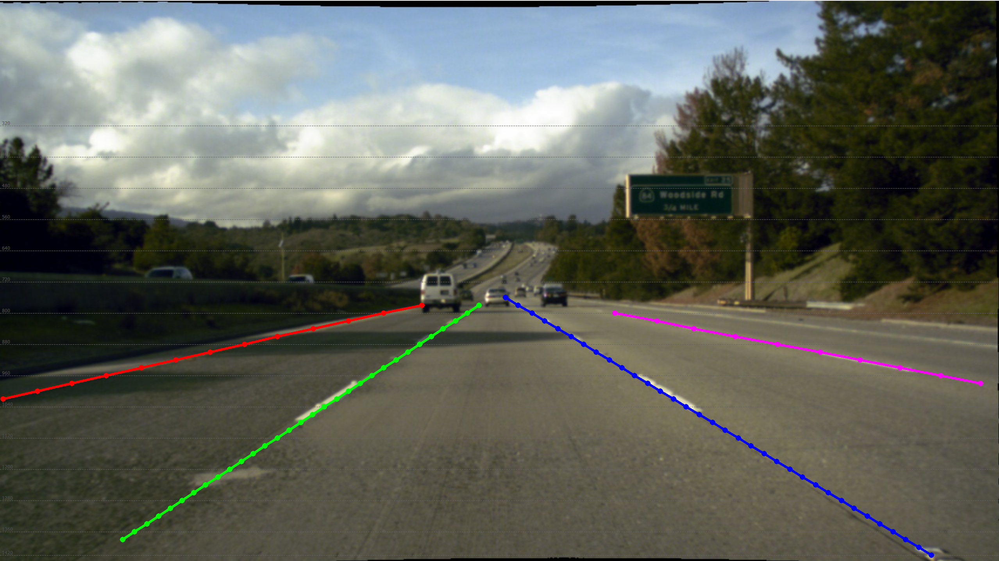
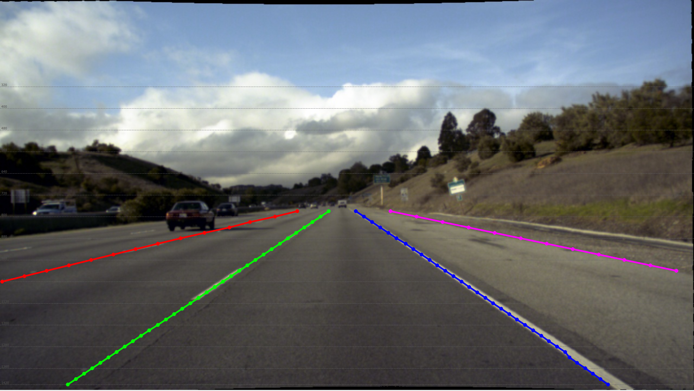

# Summary of How to Label Lanes: Case Studies

## Refresher of Principles
- Annotate up to **4 lane lines** closest to the vehicle's center. Typically: Left-Left, Left, Right, Right-Right;
- **Start/End positions**: Cover as much of the reference line as possible; for areas near the bottom of the image, use reasonable inference when necessary;
- **Road edges**: If fewer than 4 lane lines are visible, the road edge should be treated as a lane line;
- **Splits**: Should be annotated as 2 separate lane lines; these two lines share the same starting point but have different endpoints;
- **Merges**: Should be annotated as 2 separate lane lines; these two lines share the same endpoint but have different starting points;
- **Occlusion/Blur**: Use reasonable inference to complete the lane lines based on the context;

## Cases
Lane cases
- 4 lanes around vehicle
- 3 lanes and road edge
- 3 lanes (double yellow line to left)
- 3 lanes (double yellow line to left, parked cars to the right-right)
- 2 lanes (double yellow line to left, curb/parked cars to right)
- Rounded curb
- No visible lanes (residential 2-way street)

Distance cases (Lane cases are when lanes are visible from vehicle, what if they're too far away?)
- 

## Lane Cases

### Case: 4 lane lines around vehicle

*ex. Vehicle is centered between 2 lanes on the highway, with a lane on either side of the closest lanes.*

The most basic case. Following the lane labeling principles, label the lane lines to the immediate left and right of the vehicle's center, followed by labels for the "left-left" and "right-right" lanes of the vehicle.

### Case: 4 lane lines (3 normal, one next to cars) 

Same as above, but right-right/left-left lane line is next to cars

### Case: 3 lane lines and road edge

*ex. Vehicle is centered between the 2 rightmost lanes on the highway, with another lane on the "left-left" and the road edge on the "right-right" of the vehicle.*

This case mirrors Case 1, except adding in the principle that if fewer than 4 lanes are present, like in this case, the road edge on the left or right, depending on which side is closer, is labeled as a lane line.

### Case: 3 lane lines (double yellow line/parked car(s) to left, lane line/curb/parked car(s) to the right-right)

*ex. Vehicle is centered between a double yellow line to the left and a lane to the right, and a bike lane line to the "right-right" of the vehicle*

In this case, there are only 3 lanes lines labeled, as the double yellow line denotes the street as being 2-way, thus the lane line that would otherwise be the "left-left" lane line is not labeled.

#### Similar: with street to turn into on side of road

Keep labeling the lane lines past the opening of the road

#### Similar: thicker, buffer border

When the right side line is thicker, like in the image above, label the lane line to the right of the entire right side line

### Case: 2 lane lines (double yellow line to left, lane line/curb/parked car(s) to the right)

*ex. Vehicle is centered between a double yellow line to the left and the curb to the right of the vehicle.*

This case mirrors Case 3, except there is only 1 lane line/curb/parked car(s) to the right of the vehicle. Thus, only 2 lane lines are labeled.

### Case: 3 lane lines (2-way residential street, no middle line)

*ex. Vehicle seems to be driving on right side of a 2-way residential street with a stop line at the end of the road with parked cars to the right.*

In this case, with no explicit lane lines present, it is inferred that the street is 2-way. Lane lines are then drawn from the left edge of the stop line along the inferred middle line, with the left lane line drawn along the left curb, and the right lane line drawn along the side of the parked cars.

### Case: Lanes split

*ex. Vehicle is about to take an exit off the highway, with the left and "left-left" lanes labeled as the 2 lane lines of the split.*

In this case, labeling follows the principle that in the case of a lane split, the lane lines should start at the same point but end in different places, like in this case where the vehicle is taking an exit.

### Case: Lanes merge

Follow principle, lanes have different start points but same endpoint

### Case: Curved curbs

If vehicle is next to the rounded curb or is clearly in a turning lane, label along the curve of the curb. Otherwise, label a straight line on the edge of the street as usual.

### Case: Car obscuring lane

If part of the lane line is visible, estimate where the lane should be drawn. Otherwise, no annotation necessary

### Case: Cars on either/both sides

No matter if it's either or both, label the line beside all the cars. In this image, mark where you think the line should go, even through the black truck.

### Case: Mid-turn or facing curb

Don't mark anything, since the lane the vehicle is in is unknown

### Case: Bus stop

If the bus stop part of the road is empty like in the first image, mark it with a lane line. If a bus is at the indent part of the stop, mark the line alongside the bus, like in the second image

### Case: Opposite side of intersection

*ex. Vehicle is stopped at a 4-way intersection, but no lane lines or road edges are visible directly next to the vehicle.*

In this case, where explicit or implied lane lines directly next to the vehicle are not visible or are too small, the lane lines in the road across from the vehicle are labeled instead. In this case, the part of the road on the incline on the opposite side of the intersection with implied lane lines are labeled.

In this image, 2 cases are applied: opposite side of intersection and 2 lanes (yellow line and barriers to the right)

### Case: Poor visibility

Infer where lines should be based on visible lines. If lines aren't visible at all, don't mark them

### Case: Cars blocking lane ahead

If the lane is about to be obstructed by cars, the labeled line should end before the cars.

### Case: Cars already blocking lane

If cars are already obstructing the curb or lane, annotate alongside the cars

### Case: No visible lines, but speed bumps

Infer from arrows on speed bumps that it's a 2-way road, mark accordingly

### Case: Crosswalk

Annotate the lane lines as usual, but stop at the crosswalk

### Case: Next to turn lane

Label the lane lines of the turn lane like they are normal lane lines

### Case: 2 different yellow lines

Label both

### Case: Trolley or train tracks ahead

Label lines up until the tracks

### Case: Poor visibility + super narrow shoulder

Use case above for poor visibility. If the shoulder is very narrow like in the example image, don't label it, as it would be unreasonable to call that a lane.

### Case: Fragmented lanes

Label each lane all the way, even inferring their projected path

### Case: Car directly in front, partial lane blockage

Label each lane all the way, infer their projected path, only if the end of the lines are still visible

### Case: Car directly in front, partial lane blockage (end(s) covered)

Label each line where it is visible, don't infer the line

### Case: Road in/outlet on opposite side of road

Mark the line across the in/outlet like it was a straight line